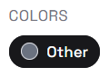

# Session Summary
](image.png)
Implemented `FOOTY` hardening for `exports` bootstrap + recommendations (rule-based + online ML fallback-safe) without breaking existing public APIs.

## What changed
- Added configurable artifacts/exports settings (`exports_dir`, bootstrap reports dir, ranker artifact filenames, min train rows).
- Added `app/ranker.py`:
  - persistent dataset/model/meta artifacts,
  - LightGBM training,
  - safe prediction with automatic fallback reason handling.
- Improved `app/bootstrap.py`:
  - required CSV column validation,
  - safer numeric parsing,
  - reconciliation counts via SQL `count`.
- Extended recommendations in `app/services.py`:
  - more event types accepted in batch ingestion,
  - expanded candidate sources (recently viewed, category affinity, tag affinity, recent orders, co-view, co-purchase, content similarity, session recency, current-category similarity, trending),
  - online rerank path via model artifacts with no-throw fallback.
- Added training pipeline hooks in `JobOrchestrator`:
  - `run_build_training_dataset_job` writes dataset JSONL,
  - `run_train_ranker_job` trains/saves ranker or returns partial with fallback reason,
  - `run_bootstrap_exports_job` bootstraps + post normalize/sync runs.
- Added API endpoints:
  - `POST /admin/imports/bootstrap-exports`
  - `GET /admin/recommendations/model`
  - `POST /admin/recommendations/train`
  - included `bootstrap_exports_job` in `/admin/jobs/{job_name}/run`.
- Added CLI utility: `backend/scripts/bootstrap_from_exports.py`.
- Updated runbook with bootstrap/retrain procedure and safe exports removal sequence.

## Tests
- `backend`: `pytest -q` -> **19 passed**.

## Notes
- Public endpoints remain backward-compatible; new functionality was added via new endpoints and optional behaviors.
- Model path is fallback-safe: recommendations still return `200` with rule-based ranking if model is absent or invalid.

## 2026-03-30 update
- Added `scripts/reset_bootstrap_exports.ps1` + root script `dev:data:reset-bootstrap`:
  - stops local stack if running,
  - backs up `backend/footy.db`,
  - recreates DB from `exports/`,
  - validates non-empty reconciliation and blocks placeholder product names.
- Switched `dev:all:smoke` to `scripts/run_local_smoke_isolated.ps1`:
  - runs smoke on isolated ports (`8100`/`3100`) and isolated DB (`backend/footy-smoke.db`),
  - cleans up processes/listeners and removes smoke DB in `finally`,
  - stops shared stack first to avoid Next.js project lock conflict.
- Updated `README.md`, `runbooks/operations.md`, and `docs/imports.md` for new workflow and explicit local DB path ownership (`backend/footy.db`).
- Added product image delivery for storefront:
  - backend now returns `image_url` in product payloads (catalog/list/detail/similar),
  - primary image is resolved from `product_images` (`is_primary` -> `sort_order` -> `id`),
  - frontend renders images in `ProductCard`, PDP hero/similar cards, and recommendation cards.
- Fixed broken image links from exports where CDN URLs ended with trailing slash after file extension (`...jpg/`), which produced `404`.
- Added PDP image gallery behavior:
  - `GET /products/{slug_or_id}` now includes `image_urls` (ordered by primary/sort order),
  - product page uses thumbnails + switchable hero image,
  - catalog/similar/recommendation cards still use primary image only.

## 2026-03-30 update (size + dedupe)
- Implemented PDP size-first variant selection:
  - backend detail payload now includes `size_options` (`size`, `variant_id`, `in_stock`, `color_key`, `color_label`),
  - frontend PDP now disables Add to cart until explicit size selection when current color has multiple in-stock sizes,
  - auto-selects variant when current color has a single in-stock size,
  - recomputes size/variant selection when color changes.
- Implemented sync-level duplicate prevention for new imports:
  - `SyncService` now finds an existing product by strict source signature (`source_system + brand + title + category + price + currency + media_signature`) before creating a new product,
  - `_ensure_variant` is now upsert-based by `(size, color)` and adds missing sizes without dropping existing ones.
- Implemented dedupe jobs for existing data:
  - `dedupe_products_dry_run_job` builds high-confidence duplicate clusters,
  - `dedupe_products_apply_job` merges clusters onto canonical product (`min(product.id)`), relinks source links, merges/moves variants, updates cart/wishlist references, and deactivates duplicate products (no hard deletes).
- Added new runnable job names in `POST /admin/jobs/{job_name}/run`:
  - `dedupe_products_dry_run_job`
  - `dedupe_products_apply_job`
- Expanded tests:
  - backend `pytest -q` now **43 passed**,
  - added service/API tests for signature-merge sync, variant upsert sizes, dry-run/apply dedupe behavior, and `size_options`,
  - extended Playwright smoke scenarios for multi-size PDP selection, color switch size recalculation, and catalog visibility after dedupe apply.

## 2026-03-30 update (primary preview backfill)
- Added `JobOrchestrator.run_refresh_product_primary_images_job`:
  - scans products whose current primary image matches `/load/<asset>/small/<number>.<ext>`,
  - builds `big/MAIN.jpg|jpeg|webp` candidates for the same asset,
  - validates candidates over network (`200` + `Content-Type: image/*`) outside request paths,
  - promotes validated MAIN image to `is_primary=true`, `sort_order=0` (idempotent behavior).
- Exposed new admin job runner key:
  - `POST /admin/jobs/refresh_product_primary_images_job/run`.
- Added regression tests:
  - service unit test for URL recognition + MAIN candidate generation,
  - service job test for success/skip/idempotent rerun behavior,
  - API smoke test proving updated `image_url` propagation across `/products`, `/catalog/products`, and `/products/{id}/similar` after job run.
- Updated runbooks/import docs with post-bootstrap step to run the new job.
- Verification: `python -m pytest backend/tests` -> **40 passed**.
